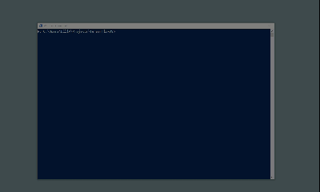

# TensorFlowJS

This project demonstrates how to use a trained Microsoft Cognitive Services Custom Vision model in 
JavaScript using [TensorFlowJS](https://www.tensorflow.org/js). [Tensorflow](https://www.tensorflow.org/) is an open source machine learning library developed by Google.

## Running the sample

To run the sample, first clone the repository.
Next, you need to serve the pages on port 8080.
One way of doing this is to start http-server from the command line.
Make sure you are in the project directory and use the command 

**http-server .** 

and then navigate in the Google Chrome browser to localhost:8080.
If you get an error "The term 'http-server' is not recognized" or similar,
you may need ot install http-server using the command **npm install -g http-server**.
If you get something like "The term 'npm' is not recognized", you need to install [NodeJS](https://nodejs.org/).

Note that I could not get this to work on older versions of Microsoft Edge, Firefox or Internet Explorer.

Once you have the page running in the browser you can choose between a number of different DNN classifiers.

### General

This gives you a page with a general classifier using MobileNet. This is trained to identify everyday objects in a similar way to the Azure Cognitive Services Computer Vision model. The output of the classifier is updated in real time from images from your webcam. This is an example of a pre-trained model.

### Thumbs

This demonstration uses a KNN (k nearest neighbours) algorithm to train a model based on MobileNet. Initially the model is unable to recognise anything. If you make a "thumbs-up" gesture while clicking on the "Thumbs-up" button you will be able to train the model to recognise this gesture, and similarly for thumbs down. You can also teach it the null case of either no hand or a neutral gesture. The more you train the model, the more accurate it becomes.

After only a minute or so of training you should be able to make the model register the thumbs-up and thumbs-down gestures in a fairly reliable way. At this point you have trained the model using supervised learning.

### Butterflies

This example uses a pre-built and previously trained model. It has been trained to recognise four species of butterfly using Azure Cognitive Services Custom Vision. Usually, the intensive computer resources are only required for training the model. The actual use of the classifier is much less compute-intensive and can be run on a mobile or edge device such as an IoT camera, or in this case in a browser on a laptop.

If you hold up a picture of one of the four butterflies (shown for reference) it will usually be able to recognise it. Sometimes only a part of the butterfly needs to be shown to the classifier - a distinctive part of the wing pattern, for example. This gives a clue as to how the classifier is working.

### Layers

The model used for the butterfly classifier was trained in the cloud and then exported as a TensorFlow model which is contained in the two files model.json (which describes the DNN model) and weights.bin (which contains the set of weights that result from the training). If you examing model.json you can see that there are over 100 layers in the neural network.

In this demonstration you can pick from a list of the more interesting layers in the select drop-down. The most interesting are the first and last of the Conv2D layers. This also gives a clue as to how the classifier is working, looking for features and using edge-detection. In practice though, it is very difficult to determine exactly how the classifier is working for a particular image. This is a common problem with many of these deep learning approaches.